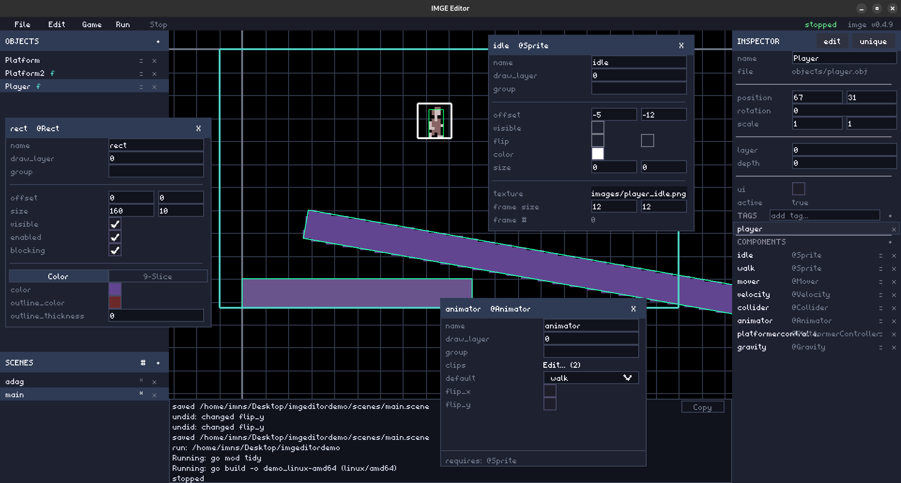

# IMGE Minimal Game Engine

**IMGE** is a minimal 2D pixel-art game engine. You describe your game with **JSON files**
(scenes and objects) and small **Go components**, then `imge build` compiles the whole thing
into a single self-contained executable — or a web (WASM) bundle. It is built on
[Ebitengine](https://ebitengine.org/), a pure-Go 2D game library, so the engine is Go all the
way down: no C/C++ engine to link against, no hidden runtime.

IMGE is built around one idea: **the tool should get out of the way**. Scenes and objects are
plain, human-readable JSON (with `//` comments), components are tiny Go structs, and there is no
mandatory boilerplate — exported, JSON-tagged fields become the component's *arguments*
automatically, and every component registers itself. A full visual **editor** is included and is
itself written with IMGE, so if a workflow feels awkward in the editor, it is awkward in the
engine too — and gets fixed.

---



## Key features

- **Minimal and intuitive** — a game is a set of **scenes**, each holding **objects**, each
  object a list of **components**. No entity framework, no mandatory architecture.
- **JSON-first** — scenes (`.scene`), object templates (`.obj`), and the game config
  (`game.imge`) are all editable JSON with `//` and `/* */` comments. The engine reads them
  directly.
- **Go components** — write behavior as small structs embedding `core.BaseComponent`. Exported,
  JSON-tagged fields are *export variables* (set from JSON); lowercase fields stay private.
  Components **auto-register** — no `init()`.
- **Built-in components** — rendering (`@Sprite`, `@Animator`, `@Rect`), physics & movement
  (`@Collider`, `@Mover`, `@Velocity`, `@Gravity`, `@Friction`), sound (`@Sound`), gameplay
  helpers (`@Health`, `@PlayerController`, `@Chase`), and a full UI kit (`@UIManager`,
  `@Button`, `@TextInput`, `@CheckBox`, `@ComboBox`, `@ColorPicker`, `@Slider`, `@List`). See
  [`docs/components.md`](docs/components.md).
- **Events** — components talk to each other with `Emit`/`On`, and reach sibling components
  directly via `core.GetFrom[...]`.
- **Cross-compile** — `imge build` produces native Linux / Windows / macOS binaries and a web
  (WASM) bundle from the same project.
- **The IMGE Editor** — a visual, in-engine editor for placing objects, tweaking components,
  building scenes, and running the game — described below and in
  [`docs/editor.md`](docs/editor.md).

## The editor

The **IMGE Editor** is a full graphical editor that ships inside the `imge` CLI. It is written
entirely in IMGE itself (the editor is a normal IMGE project), which is deliberate: the editor
and the games you build use the same components, the same JSON, and the same rendering.

```sh
imge editor          # open the current project
imge editor path/to/my-game   # open a specific project
```

With it you can:

- **Open / create** projects, scenes, and object templates from the menu bar.
- **Navigate** the viewport — pan, zoom, a configurable grid and axes.
- **Place, move, duplicate and remove** objects by dragging with grid/pixel snapping.
- **Edit every component** in a dedicated arguments window (checkboxes, sliders, color pickers,
  file pickers — not raw text where a control fits better).
- **Isolate-edit** an object template (`.obj`) in its own editor, with changes written through
  to every instance that references it.
- **Undo/redo** everything (`Ctrl+Z` / `Ctrl+Y`), with unsaved-change protection on close.
- **Run and stop** the game in place (`F5`), with its output captured in the console.

The editor is documented in depth in [`docs/editor.md`](docs/editor.md) — every panel, menu,
shortcut, and setting, in its current state.

## What you need

- **Go 1.24+** — `imge` uses the Go toolchain to compile your game. Get it from
  [go.dev/dl](https://go.dev/dl/).
- **The `imge` CLI** — download the binary for your OS/architecture from the
  [latest release](https://github.com/EnesBaytekin/imge/releases) and put it on your `PATH`.

Release assets are named `imge_<os>_<arch>` (`.exe` on Windows):

| File | Platform |
| --- | --- |
| `imge_linux_amd64` / `imge_linux_arm64` | Linux (Intel/AMD 64-bit / ARM 64-bit) |
| `imge_windows_amd64.exe` / `imge_windows_arm64.exe` | Windows (64-bit / ARM 64-bit) |
| `imge_darwin_amd64` / `imge_darwin_arm64` | macOS (Intel / Apple Silicon) |

> The first build needs internet once: `imge` fetches Ebitengine from the Go module proxy.
> The engine source is embedded inside the `imge` binary, so you don't fetch it separately.

## Quick start

```sh
mkdir mygame && cd mygame
imge init      # scaffold a project (only works in an empty directory)
imge run       # build and launch — move with WASD, enemies chase you
```

`imge init` creates a project like this:

```
mygame/
├── game.imge      # window title/size, FPS, initial scene
├── components/    # your Go components (any nesting depth)
├── scenes/        # scene definitions (.scene)
├── objects/       # object templates (.obj)
└── assets/        # images and sounds
```

Prefer a visual workflow? Run `imge editor` in the project instead of editing the JSON by hand.

## How a game is made

A game is a set of **objects** placed into **scenes**. Each object is a list of
**components**. Built-in components come with the engine; user components are small Go files
you write in `components/`.

- **Objects** (`objects/*.obj`) — JSON: a name, depth, tags, and a list of components.
- **Scenes** (`scenes/*.scene`) — JSON: a background color and the objects to place.
- **Components** (`components/*.go`) — Go structs that embed `core.BaseComponent` and write
  `Initialize`/`Update`/`Draw`. Exported, JSON-tagged fields are "export variables" — their
  values come from the component's `args` in the object/scene JSON; lowercase fields stay
  private. Components auto-register (no `init()`).
- **Assets** (`assets/`) — PNG/JPEG images and WAV/MP3/OGG sounds, embedded into the build.

Example — give an object a sprite and a hitbox:

```json
{ "kind": "@Sprite",  "name": "sprite", "args": { "texture": "assets/player.png", "width": 32, "height": 32 } },
{ "kind": "@Collider", "name": "hitbox", "args": { "width": 32, "height": 32 } }
```

A component is just a struct plus a few methods:

```go
type Enemy struct {
    core.BaseComponent
    Speed float64 `json:"speed"` // export variable
}

func (c *Enemy) Initialize() { if c.Speed <= 0 { c.Speed = 60 } }

func (c *Enemy) Update(ctx *core.Context) {
    // ctx.DeltaTime(), ctx.Input, ctx.Scene, core.GetFrom[...] to reach other
    // components, and c.Emit(name, data) / c.On(name, handler) for events.
}
```

## Building

```sh
imge build                    # native build for your machine
imge build --windows          # Windows, amd64 + arm64
imge build --amd64            # amd64 for every OS
imge build --windows --amd64  # Windows amd64 only
imge build --web              # web (WASM) bundle
imge build --windows --web    # Windows (both archs) + web
imge build --all              # every buildable target (skips what it can't)
```

Flags: `--linux --windows --macos` pick the OS, `--amd64 --arm64` pick the architecture
(omit either to target all of them), `--web` builds the web bundle, `--all` builds everything
it can.

Output goes to `imge_build/`:

- **Desktop**: `imge_build/<name>_<os>-<arch>` (`.exe` on Windows) — a single self-contained
  executable; copy it anywhere and run it.
- **Web**: `imge_build/web/` — serve it locally:

```sh
cd imge_build/web
python3 -m http.server 8000   # then open http://localhost:8000/
```

### Cross-compilation

Windows (amd64/arm64) builds from any host (pure Go). macOS and non-native Linux targets need
Ebitengine's Cgo (GLFW), so build those natively or via CI — `imge build` prints which
targets it skipped and why.

## Documentation

Full documentation lives in [`docs/`](docs/) — start with
[Getting started](docs/getting-started.md), then the
[editor guide](docs/editor.md), the [component reference](docs/components.md), and the
[cookbook](docs/cookbook.md).

## License

MIT
