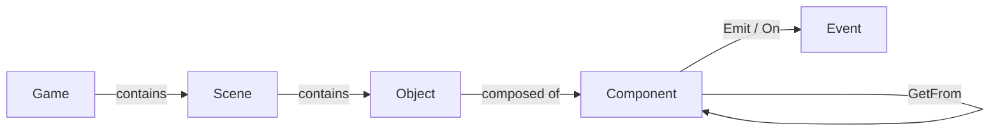

# IMGE Documentation

Welcome to the **IMGE** (Minimal 2D Game Engine) documentation. This is the
reference a developer needs to build a game with IMGE — from scaffolding a project
to writing custom components and combining them into a full game.

IMGE is a 2D pixel-art game engine written in Go on top of
[Ebitengine](https://ebitengine.org/). You describe your game with **JSON files**
(scenes, objects) and small Go **components**, then `imge build` compiles it all
into a single self-contained executable or a web (WASM) bundle.

## Read this first

| | | |
|---|---|---|
| [**Getting started**](getting-started.md) | Install, `imge init`, and your first running game | 5 min |
| [**Project structure**](project-structure.md) | What every file and directory is for | 3 min |
| [**The `imge` tool**](cli.md) | `init` / `build` / `run` / `version`, flags, cross-compilation | 5 min |

## Core concepts

| | | |
|---|---|---|
| [**Objects**](objects.md) | The entity model: transform, tags, depth, UI, lifecycle | 10 min |
| [**Scenes & camera**](scenes-and-camera.md) | Scene management, scene switching, the camera | 10 min |
| [**Components (reference)**](components.md) | Every built-in component, its args, methods, and events | reference |
| [**Custom components**](custom-components.md) | Write your own components: export variables, `Requires`, lifecycle | 10 min |
| [**Events**](events.md) | The event system: `Emit`/`On`, delivery order, `Source`, `@StateMachine` scopes | 10 min |

## Reference

| | | |
|---|---|---|
| [**JSON format**](json-format.md) | Full format for `game.imge`, `.scene`, `.obj`, and component `args` | reference |

## Recipes

| | | |
|---|---|---|
| [**Cookbook**](cookbook.md) | Worked patterns: platformer controller, enemies, pickups, scene transitions, HUD | how-to |

## The model in one paragraph

A game is a set of **scenes**. Each scene contains **objects**. Each object is a
list of **components**. Components hold the logic and data; the built-ins
(`@Sprite`, `@Collider`, `@Mover`, `@Velocity`, `@Health`, …) cover rendering,
movement, collision, and combat, and you write your own in Go to add game-specific
behavior. Components talk to each other with **events** (`Emit`/`On`), and reach
sibling components on the same object directly via `core.GetFrom[...]`.

Continue with [Getting started](getting-started.md).
