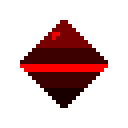
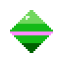
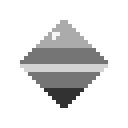
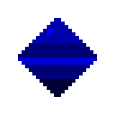

# Color effects (`@Sprite` `color`)

> ← [Documentation index](README.md) · [Components](components.md)

The `@Sprite` `color` arg recolors a texture **at draw time** — the source image on
disk is never changed, so one sprite sheet can be reused for any number of palette
variants. Every knob lives under a single `color` object:

```json
{
  "kind": "@Sprite", "name": "sprite",
  "args": {
    "texture": "assets/player.png",
    "color": {
      "grayscale": false,
      "hue": 0,
      "hue_to": { "r": 255, "g": 0, "b": 0, "a": 255 },
      "tint": { "r": 255, "g": 255, "b": 255, "a": 255 },
      "solid": false
    }
  }
}
```

All fields are optional. The zero value of the whole `color` object is **identity**
(a plain draw) — that common case is detected and runs on a fast path with no
recolor work. `tint` and `hue_to` accept either an `{r,g,b,a}` object or a hex
string (`"tint": "#ff0000"`).

## The fields

| Field | Type | Default | Effect |
|---|---|---|---|
| `grayscale` | bool | `false` | desaturate to perceived brightness (luma) |
| `hue` | number (degrees) | `0` | rotate the hue around the color wheel |
| `hue_to` | `{r,g,b,a}` or `"#RRGGBB"` | unset | rotate the texture's dominant hue to this color's hue |
| `tint` | `{r,g,b,a}` or `"#RRGGBB"` | white | multiply each channel; can only darken, never brighten |
| `solid` | bool | `false` | replace RGB with `tint`, keeping the texture's alpha (a silhouette) |

## Side by side

The same 32×32 sample sprite (a blue gem, shown 4×) under each effect:

| Original | `tint` red | `hue` 120° |
|---|---|---|
|  |  |  |

| `hue_to` green | `grayscale` | `solid` red | `grayscale` + blue `tint` |
|---|---|---|---|
|  |  |  |  |

> These images are produced by the exact color math the engine runs at draw time
> (see `cmd/colordemo`), so they match engine output pixel-for-pixel.

## Each field, in detail

### `grayscale` — desaturate

`grayscale` collapses each pixel to its **luma** (perceived brightness:
`0.299R + 0.587G + 0.114B`) replicated across R, G, and B. Shading and alpha are
kept, only the color goes away.

```json
{ "grayscale": true }
```

### `hue` — rotate

`hue` rotates the hue forward by the given degrees (wraps at 360). `0` = red,
`120` = green, `240` = blue. A `120` rotation turns a blue gem red/pink and a
yellow highlight cyan, while keeping each pixel's brightness.

```json
{ "hue": 120 }
```

The rotation is done in YCrCb space (the same conversion Ebitengine uses), which
**preserves luma** — perceived brightness. Concretely:

- Near-black shadows and white highlights keep their brightness while the hue
  shifts, so shading survives a recolor.
- Neutral (gray) pixels are unchanged.
- Because this is a linear approximation, the resulting hue is not *exact* for
  highly saturated colors: a pure red rotated `120` lands on a dark green rather
  than a bright green. That "keep the shading" trade-off is intentional.

### `hue_to` — rotate to a target

`hue_to` rotates the texture's **dominant hue** to the given color's hue. This is
the field to use when you want "this sprite, but in that team's color", regardless
of what the source hue actually is.

```json
{ "hue_to": { "r": 0, "g": 255, "b": 0, "a": 255 } }
```

The dominant hue is the circular mean of every pixel's hue, weighted by saturation
and alpha, computed **once at texture load**. It works best on sprites dominated by
one hue family. A grayscale texture has no dominant hue, so `hue_to` has no effect
on it. If you also set `hue`, the two add together — `hue` is an extra offset on
top of the `hue_to` rotation.

### `tint` — multiply

`tint` multiplies each channel by its tint value. Because channels are 0–1, a tint
can only **darken** a color, never brighten it. White (`255,255,255`) is identity.

```json
{ "tint": { "r": 255, "g": 0, "b": 0, "a": 255 } }
```

A red tint keeps the red channel and zeroes green and blue — everything becomes a
shade of red (blue → black, yellow → red). A tint with `a < 255` also fades the
sprite, because the alpha channel is multiplied too:

```json
{ "tint": { "r": 255, "g": 255, "b": 255, "a": 128 } }
```

This is a cheap "ghost" / transparent version of any sprite.

### `solid` — silhouette

`solid` replaces every opaque pixel's RGB with `tint`, producing a flat silhouette
in the tint color while the texture's alpha still defines the shape. A
semi-transparent tint yields a semi-transparent silhouette.

```json
{ "solid": true, "tint": { "r": 255, "g": 0, "b": 0, "a": 255 } }
```

Useful for hit-flash effects (a white or red silhouette), shadow blobs, or
placeholders before real art is ready.

## How they combine

The knobs compose in a **fixed pipeline**, always in this order:

```
grayscale  →  hue (or hue_to)  →  tint (multiply)  →  solid
```

The rules fall out of that order. In practice:

| If you set… | …then |
|---|---|
| `solid` with anything else | RGB is replaced by `tint`, so `hue` and `grayscale` have **no visible effect**. Alpha still comes from the texture (the shape) × `tint`'s alpha. |
| `grayscale` + `hue` | Grayscale runs first and removes all color, so `hue` has nothing left to rotate — the result is just grayscale. |
| `hue_to` + `hue` | Both rotate; they add. `hue_to` sets the rotation to reach its target, `hue` adds an extra offset on top. |
| `tint` with any of the above | Tint multiplies last (before `solid`), so it darkens whatever grayscale/hue produced. |

There are no errors or runtime warnings for "useless" combinations — a no-op just
renders as if the ignored knob weren't set. The table above is the behavior to keep
in mind.

## Runtime

In Go, the transform is a `math.ColorTransform`; the `@Sprite` field is `Color`.
Set it at runtime with `SetColor`:

```go
sprite.SetColor(math.ColorTransform{Tint: math.Red})
sprite.SetColor(math.ColorTransform{Solid: true, Tint: math.White}) // hit flash
```

`DominantHue(img)` computes the dominant hue of an image, and
`ColorTransform.Matrix(dominantHue)` resolves the whole pipeline into a single
matrix — both live in `core/math` and are unit-tested.
