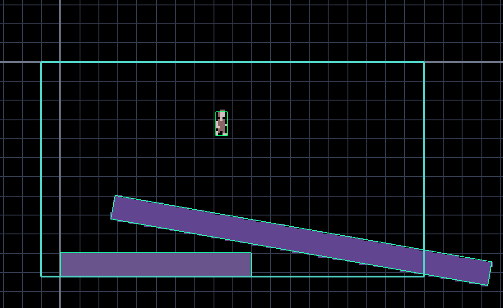
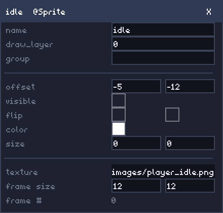

# The IMGE Editor

The **IMGE Editor** is the visual editor that ships inside the `imge` CLI. It is itself a
normal IMGE project: the same engine, the same components, and the same JSON that your games
use. It exists to make "place an object, tweak its components, run it, see the result" feel
direct — no hand-editing JSON for the parts that are better done visually.

This page documents the editor **in its current state**. It is a living reference: as the
editor grows, this page grows with it.

> **Screenshots.** Every image in this guide is a placeholder — capture the matching screen,
> name it as indicated, and drop it in `docs/assets/`. Each placeholder says which file to use.

---

## Contents

- [The IMGE Editor](#the-imge-editor)
  - [Contents](#contents)
  - [Launching the editor](#launching-the-editor)
  - [The window layout](#the-window-layout)
  - [The menu bar](#the-menu-bar)
    - [File](#file)
    - [Edit](#edit)
    - [Game](#game)
    - [Run / Stop](#run--stop)
  - [Keyboard shortcuts](#keyboard-shortcuts)
  - [The viewport](#the-viewport)
    - [Camera](#camera)
    - [Grid and axes](#grid-and-axes)
    - [Selection](#selection)
    - [Moving objects](#moving-objects)
    - [Placing, duplicating, removing](#placing-duplicating-removing)
  - [Scene tree — objects](#scene-tree--objects)
  - [Scene list — scenes](#scene-list--scenes)
  - [The inspector](#the-inspector)
    - [Properties](#properties)
    - [Tags](#tags)
    - [Components](#components)
    - [Provenance: file-referenced vs. inline](#provenance-file-referenced-vs-inline)
  - [The component arguments window](#the-component-arguments-window)
    - [Widgets](#widgets)
    - [Committing](#committing)
    - [Built-in custom layouts](#built-in-custom-layouts)
  - [The object editor](#the-object-editor)
  - [The console](#the-console)
  - [Tooltip](#tooltip)
  - [Dialogs \& modals](#dialogs--modals)
    - [Add Component](#add-component)
    - [Game Settings](#game-settings)
    - [Scene Settings](#scene-settings)
    - [Editor Settings](#editor-settings)
    - [File Browser](#file-browser)
    - [Project Picker](#project-picker)
    - [New Scene](#new-scene)
    - [Open Project](#open-project)
    - [Confirm](#confirm)
    - [Close Confirm (unsaved changes)](#close-confirm-unsaved-changes)
    - [Text Prompt](#text-prompt)
  - [Undo \& redo](#undo--redo)
  - [Save \& unsaved changes](#save--unsaved-changes)
  - [Run \& stop](#run--stop-1)
  - [The editor settings cache](#the-editor-settings-cache)

---

## Launching the editor

From inside a project directory:

```sh
imge editor            # open the current directory as the project
imge editor path/to/my-game   # open a specific project
```

- With no path, `imge editor` opens the current directory — but only if it is a project
  (it contains a `game.imge`).
- The editor requires a project to open; it refuses a directory that isn't one.
- The editor binary is **embedded inside `imge`** and built on first use, then cached under
  your user cache directory (`~/.cache/imge/editor/<key>/` on Linux, the equivalent on
  Windows/macOS). The cache key is derived from the engine version and the embedded editor +
  engine source, so a new `imge` binary rebuilds the editor automatically; an unchanged one
  reuses the cached build and starts instantly.
- The `imge` CLI passes the target project to the editor via the `IMGE_PROJECT` environment
  variable, and its own path via `IMGE_CLI` so the editor's **Run** button can shell back out
  to the CLI.

The editor edits the project **in place** — the same files `imge build` reads. There is no
separate "project format" for the editor.

---

## The window layout

The editor window is a fixed layout of panels. Reading roughly clockwise:

- **Top** — the **menu bar**: `File` / `Edit` / `Game` / `Run` / `Stop`, plus a status line
  and the engine version on the right.
- **Left** — the **scene list** (all scenes in the project) above the **scene tree** (the
  objects in the current scene).
- **Center** — the **viewport**: the scene being edited, with a grid and axes.
- **Right** — the **inspector**: the properties, tags, and components of the selected object.
- **Bottom** — the **console**: the captured output of Run/build plus editor log lines.

Floating windows (component-argument windows, the object editor, and every dialog) appear on
top of this layout, are draggable by their title bar, and can overlap freely.

<!-- Screenshot placeholder: the full editor window, panels labeled. →
     docs/assets/editor-overview.png -->


---

## The menu bar

The menu bar is a row of tabs. `File`, `Edit`, and `Game` drop down a list when clicked;
`Run` and `Stop` are *direct* buttons that act immediately (they never open a menu). Clicking
a tab opens its menu; clicking the open tab, another tab, or anywhere else closes it. While a
menu is open the rest of the editor is inert, so the dismiss click is consumed rather than
leaking into the panel beneath.

### File

| Entry | Shortcut | What it does |
|---|---|---|
| Open Project… | — | Opens the **project picker** to load a project from anywhere on the filesystem |
| New Project… | — | Opens the **project picker** in *new* mode to create a blank project |
| Save | `Ctrl+S` | Writes the loaded scene back to its `.scene` file |
| Browse Files… | — | Opens the **file browser** over the current project's files |

### Edit

| Entry | Shortcut | What it does |
|---|---|---|
| Undo | `Ctrl+Z` | Reverts the most recent edit |
| Redo | `Ctrl+Y` | Re-applies the most recently undone edit |
| Editor Settings… | — | Opens the **editor settings** dialog (grid spacing) |

### Game

| Entry | Shortcut | What it does |
|---|---|---|
| Game Settings… | — | Opens the **game settings** dialog (the full `game.imge` editor) |

### Run / Stop

| Button | Shortcut | What it does |
|---|---|---|
| Run | `F5` | Builds and launches the project (dimmed while already running) |
| Stop | — | Kills the running preview (dimmed when nothing is running) |

The status line on the right reports the outcome of the last action (`saved`, `undone`,
`redone`, `running`, `stopped`, `exited`, or an error), and the engine version is pinned at
the far right.

---

## Keyboard shortcuts

| Keys | Action | Notes |
|---|---|---|
| `Ctrl+S` | Save the scene | Skipped while a text field holds keyboard focus |
| `Ctrl+Z` | Undo | Editor-wide undo of the last committed edit |
| `Ctrl+Y` | Redo | Also `Ctrl+Shift+Z` |
| `F5` | Run the project | Builds + launches |
| `Esc` | Close the focused window | Closes the focused component-args window or object editor; a focused widget (text input, color picker, combobox) consumes `Esc` itself first |
| `Ctrl+A` / `Ctrl+C` | Console select-all / copy | Act on the console's text selection |
| Middle-drag, or `Space`+left-drag | Pan the viewport | — |
| Mouse wheel | Zoom the viewport | — |
| `↑` / `↓` | Move the cursor | In the file browser and project picker lists |
| `Enter` | Activate the cursor row | In the file browser and project picker |
| `Backspace` | Go up a directory | In the project picker |

See [The viewport](#the-viewport) for the drag-snapping modifiers (`Shift` / `Alt`).

---

## The viewport

The viewport is the central canvas: it draws the scene through the engine's own renderer,
overlaid with the editing grid and axes. It is also where you select, move, and place objects.

### Camera

- **Pan** — middle-drag, or hold `Space` and left-drag.
- **Zoom** — the mouse wheel, about the pointer, from **0.1× to 16×** (×1.15 per notch).

The camera (pan + zoom) is remembered **per scene** and restored when you switch back (see
[The editor settings cache](#the-editor-settings-cache)).

### Grid and axes

The grid uses the spacing configured in **Editor Settings** (default 32×32 world units — a
static world lattice that does not get denser or sparser with zoom), and the axes mark the
origin. Their colors and spacing are editor-only preferences — they affect the editing view,
never the built game.

### Selection

Click an object to select it. The selection is outlined in the viewport and fills the
inspector. Selecting does **not** create an undo entry — selection is navigation, not an edit.

### Moving objects

Drag a selected object to move it. Movement snaps to one of three resolutions, chosen by the
modifier held during the drag:

| Modifier | Snap step | Meaning |
|---|---|---|
| *(none)* | 1 world unit | The default "whole pixel" feel |
| `Shift` | the grid step | Aligns to the editing grid |
| `Alt` | `1 / pixel_per_unit` | Fine sub-unit movement that still lands on a representable pixel |

A drag records a single undo entry when it ends.

### Placing, duplicating, removing

Objects are added, duplicated, and removed from the viewport (or equivalently from the scene
tree):

- **Add** an empty object, or place an object from an existing `.obj` template (a *file
  reference* — see [The inspector](#the-inspector)).
- **Duplicate** the selected object.
- **Remove** the selected object.

All three are undoable.



---

## Scene tree — objects

The **scene tree** (the "OBJECTS" panel) lists every object in the currently loaded scene.

- **`+`** — add an object: a dropdown offers **Empty object** or **Load from .obj…** (which
  opens the file picker filtered to `.obj` files; choosing one places that template as a
  file-referenced object).
- **`=`** — duplicate the selected object.
- **`x`** — remove the selected object.

Switching scenes is a scene-level undo boundary; add/remove/duplicate are all undoable.

---

## Scene list — scenes

The **scene list** (the "SCENES" panel) lists every `.scene` file in the project.

- Click a row to **switch** to that scene (undoable).
- **`*`** — mark a scene as the **start scene** (the one the game launches into).
- **`x`** — **delete** the scene (undoable — undoing restores the deleted `.scene` file).
- **`#`** — open the **scene settings** dialog for that scene.
- **`+`** — create a **new scene** (opens the new-scene dialog).

---

## The inspector

The inspector shows the **selected object** (or, while the object editor is open, the object
being edited there). It is grouped into sections.

### Properties

The object's identity and transform fields:

- **identity** — `name`, and `file` (the `.obj` template this object references, if any).
- **transform** — `position` (x, y), `rotation`, `scale` (x, y).
- **scene** — `layer` (render layer), `depth` (draw order within a layer).
- **flags** — `ui` (is this a screen-space UI object), `active` (is it running/updating).

Edits here commit the same way as the component arguments (see
[Undo & redo](#undo--redo)).

### Tags

The object's **tags** (string markers for queries and collision filtering). Add a tag or
remove an existing one inline.

### Components

The list of components on the object, in draw order. Each row can be:

- **clicked** — opens the [component arguments window](#the-component-arguments-window) for
  that component;
- **edited** — opens the object editor (or the component's args window);
- **removed** — deletes the component (with a confirmation), undoable;
- **duplicated** — clones the component with a new unique name.

Adding a component opens the **Add Component** dialog (see below).

### Provenance: file-referenced vs. inline

Objects can be **inline** (defined entirely in the scene) or **file-referenced** (defined in a
`.obj` template, placed into the scene by reference). For a file-referenced object the
inspector offers two conversions:

- **make unique** — drop the `.obj` reference and inline the definition, so this object stops
  sharing changes with other instances.
- **make object** — save this object's current definition out to a `.obj` template (prompting
  for a filename), so other scenes can reference it.

Editing a file-referenced object's *definition* (its components and tags — not its transform)
writes through to the shared `.obj` template, so every instance that references it updates
immediately.

---

## The component arguments window

Clicking a component (in the inspector, or the object editor) opens a floating **arguments
window** titled `<name>  <kind>`. Several can be open at once; they cascade down-right and
are draggable by their title bar, with an `X` in the top-right to close.

The window discovers the component's arguments by reflection over its **exported, JSON-tagged
fields** — exactly the fields populated from the component's `args` object on load — and
shows one row per argument. Edits mutate the live component, so the viewport reflects them the
next frame; they are serialized back to the project on Save.

### Widgets

Each editable argument gets a real engine widget, chosen by its type — not a raw text box
where a control fits better:

| Type | Widget |
|---|---|
| string / number | `@TextInput` |
| bool | `@CheckBox` |
| color | `@ColorPicker` |
| enum / named choice | `@ComboBox` (e.g. the Animator's `default` clip) |
| bounded int | `@Slider` (e.g. the Sprite's `frame`) |
| project file path | a file button that opens the file picker (e.g. a Sprite's `texture`) |

`math.Vector2` fields (like `offset`) render as two side-by-side boxes (`x`, `y`), and
`math.Border` as four (`left`, `top`, `right`, `bottom`).

### Committing

- **Text fields** commit on `Enter` or when they lose focus; a parse failure tints the box
  red (and, on blur, reverts the text).
- **Checkboxes, color pickers, and comboboxes** commit immediately on change.
- **Sliders** live-apply the value during the drag but commit a single undo entry on release —
  one drag, one undo step.

The top row always edits the component's **name** (non-empty and unique within its object).
Components that declare dependencies (via `Requires()`) show a **"requires: …"** footer,
flagged red when a required component is missing from the object.

### Built-in custom layouts

A few built-in components get a purpose-built layout instead of the generic reflection list:

- **`@Sprite`** — grouped: common fields, `offset`, `visible`/`flip`, `color` tint, `size`,
  then a texture section. The frame-size / frame-# rows appear only once a texture is set.
  When an `@Animator` drives this sprite, its `visible`/`flip`/`frame` fields are **locked**
  (shown dimmed as read-only) because the animator owns them.
- **`@Rect`** — a **Color / 9-Slice** tab strip. Switching tabs changes the fill mode
  *without wiping the other mode's data*: the `color` and the `texture`+`border` both persist
  to JSON; only the active mode flips. The Color tab shows `color`, `outline_color`,
  `outline_thickness`; the 9-Slice tab shows `texture` (file picker) and `border`.
- **`@Animator`** — its `default` clip is a combobox of the sprites the clips name, and its
  `clips` row reads **"Edit… (n)"** and opens the dedicated **Animator Clips** editor: every
  `@Sprite` on the object is listed with a tick checkbox (adds/removes a clip), an FPS box,
  and a loop toggle — no typing sprite names by hand.



---

## The object editor

The **object editor** is an isolated editor for a single object template (`.obj`): it opens
the object in its own throwaway world — not inside the scene — so you can work on a template
without the rest of the scene around it.

- Open it from the inspector's component list (**edit**) or from the file browser's `.obj`
  preview (**Edit**).
- Edits here are **write-through**: they apply to the `.obj` file and to every instance in the
  scene that references it, immediately.
- Components can be dragged to move within the object (their `offset`), with the same
  grid/pixel snapping as the viewport.

Unlike the dialogs, the object editor is a **focus**, not a modal: while it is open it pauses
the viewport and scene tree, but the inspector and component-args windows stay live. `Esc`
closes it (unless a widget holds focus).

---

## The console

The **console** (the bottom strip) captures the output of **Run**/build plus a few editor log
lines (save, run/stop, undo/redo). It is a ring buffer capped at the most recent **500** lines,
so a long build can't grow the log unbounded.

- **Follows the bottom** by default; scroll up with the wheel to look back (scroll = lines
  back from the newest; scrolling down returns to follow mode).
- **Text is selectable** with a mouse drag, and copyable with `Ctrl+C` or the **Copy** button
  (top-right). `Ctrl+A` selects everything. A copy failure is reported; a successful copy is
  silent so it doesn't pollute the log it came from.

---

## Tooltip

A small floating tooltip appears over controls that benefit from a hint (for example, the
close button of a floating window reads "Close"). It is purely a convenience label.

---

## Dialogs & modals

The editor has one active **modal** at a time: while a modal is open, every other panel yields,
and clicking outside the modal dismisses it (the press that opened it is swallowed so it can't
open-and-close on one click). Floating windows (args window, object editor) are *not* modals —
they coexist and yield to whatever is drawn above them.

### Add Component

Opened from the inspector's add-component control. A combobox of every component kind — the
built-ins (`@Sprite`, `@Collider`, …) and your project's custom components — picks the kind to
add; the new component is attached with a unique default name (undoable). Project components
the editor did not compile in are still listed and added as verbatim placeholders, so they
round-trip without being lost.

### Game Settings

The full `game.imge` editor: window title/size/resizable, `pixel_per_unit`, `scale`,
`smooth_shapes`, target FPS, and the initial scene — with **Save** / **Close**.

### Scene Settings

Per-scene settings for the selected scene: **Name**, **Background color**, and **Camera**
(x, y, zoom). Auto-saved and undoable; renaming the current scene follows `initial_scene` if
it pointed at the old name.

### Editor Settings

Editor-only preferences: **Grid Width** and **Grid Height** (the grid spacing). These are
undoable but deliberately **not** counted as unsaved *scene* edits — they are editor state,
not project data.

### File Browser

The floating "Browse Files" window (File → Browse Files…). A directory tree on the left
(collapsible), a preview on the right:

- **images** render their texture with its pixel size;
- **`.obj`** files show their name and component count, with an **Edit** button that opens the
  object editor;
- **`.scene`** files show their display name;
- everything else shows "no preview".

Navigate with the mouse or the keyboard (`↑`/`↓` move the cursor, `Enter` opens a
directory/selects a file). The same window in **pick mode** becomes a file selector for a
specific purpose (e.g. choosing a Sprite's texture, or loading a `.obj` into the scene).

### Project Picker

The filesystem browser for **Open Project…** and **New Project…**. Unlike the file browser, it
navigates **absolute** filesystem paths, one directory at a time (starting from the current
project, or your home directory).

- **Open mode** — enter directories; selecting the `game.imge` (or pressing Open while the
  folder holds one) loads that directory as the project.
- **New mode** — the same navigation plus a **game name** field and a "create a folder with
  this name" checkbox; Create writes a blank project (`game.imge` + `scenes/main.scene`) into
  `<folder>/<name>` (or straight into the folder) and loads it.

An unreadable directory is shown as an error line rather than a crash, with `..` always
available to climb back out.

### New Scene

A name field and Create/Cancel. Create writes an empty `.scene` with that name and switches to
it; an invalid or duplicate name shows an error and keeps the dialog open.

### Open Project

The simpler project switcher: a path field seeded with the current project, and Open/Cancel.
(There is also the richer project picker, above.)

### Confirm

A small confirmation popup ("Delete" / "Cancel"), used to confirm removing a component.

### Close Confirm (unsaved changes)

Shown when you close the editor window with unsaved scene edits. Three buttons: **Save**
(write, then quit), **Don't Save** (quit without writing), and **Cancel** (keep editing).

### Text Prompt

A generic single-line prompt (title, a text field seeded with an initial value, OK/Cancel). It
backs the "save as object" filename prompt; the OK callback returns an empty string to accept
or an error message to keep the dialog open.

---

## Undo & redo

Every committed edit — component-argument writes, object-property edits, viewport drags,
object/component add-remove-duplicate, scene create/delete/switch, and settings — records a
single undo step. The history:

- is **editor-wide**, capped at **100** steps;
- **clears the redo stack** on any new edit (a fresh edit invalidates the redo chain);
- **switches scene automatically** when you undo/redo an edit made in another scene, so the
  change applies (and displays) where it happened;
- **re-opens** a closed arguments window if an undone/redone edit belongs to it, so the change
  is visible again.

**Selection changes are not recorded** — selecting is navigation, not an edit. A slider drag
records one step on release, not one per frame. New-project switching clears the history, since
undo entries reference the previous project's live objects.

---

## Save & unsaved changes

- **Save** (`Ctrl+S`, or File → Save) writes the currently loaded scene back to its `.scene`
  file and marks the document clean.
- Edits that change *project data* (scene/object/game-config) mark the document **dirty**;
  editor-only state (selection, grid size, camera) does not.
- Closing the window with a dirty document shows the **unsaved-changes** prompt. **Run** also
  auto-saves the loaded scene first, so the preview reflects your in-progress edits.

---

## Run & stop

- **Run** (`F5`, or the Run button) builds and launches the target project via `imge run`, in
  its own process group so **Stop** can kill the whole group (the CLI *and* the game it
  spawned). The loaded scene is auto-saved first. Build/game output streams to both the
  console and the terminal that launched the editor.
- **Stop** sends `SIGKILL` to the running process group.
- A run that exits on its own clears the handle and reports `exited`.

---

## The editor settings cache

The editor persists its own state per project in a hidden **`.imge.editor`** file at the
project root — next to `game.imge`, but never part of the built game (the build tool skips it,
and you can add it to your own `.gitignore`). It stores only editor-view state:

- the viewport **grid spacing** and **grid/axes colors**;
- the last **camera** pan/zoom for the scene and for each object editor;
- the last **selected object**.

It is read on load and written when the editor closes (and before any quit path), so reopening
a project restores the view you left it at.
