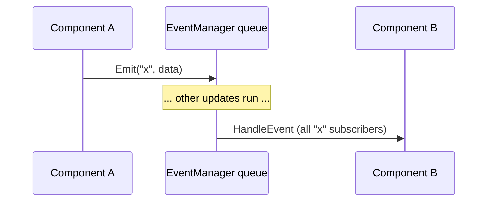

# Events

Events are IMGE's message bus: a component **emits** an event, and every component
that registered a handler for that event's name receives it. They decouple
components — a coin doesn't need to know who counts it, it just emits
`coin_collected`.

## Emitting and listening

```go
// In any component (BaseComponent provides these):
c.On("damaged", func(data any) {
    amount := data.(float64) // depends on the emitter's contract
})
c.Emit("coin_collected", nil)
```

- `On(name, handler)` registers a handler. Register handlers in `Initialize()`,
  before the first update. Multiple handlers for the same name run in **registration
  order**.
- `Emit(name, data)` queues an event for delivery. `data` is an arbitrary value
  (`any`) — its type is the emitter's contract (see the table below).

## The `Event` struct

An event carries:

| Field | Type | Notes |
|---|---|---|
| `Name` | string | the event type (e.g. `"trigger_enter"`) |
| `Data` | `any` | extra information, interpreted by the listener |
| `Source` | `Component` | the emitting component, or `nil` for engine-generated events |

Listeners can inspect `Source` to filter — a `@StateMachine` uses it to match its
`from` scopes, and you can do the same in a handler.

## Delivery timing (important)

Events are **queued**, not immediate:

1. During `Scene.Update`, components call `Emit`, which appends to the scene's
   `EventManager` queue.
2. **After every** component's `Update` has run, `EventManager.Process()` delivers
   all queued events to their subscribers, in emission order.

Consequences:

- An event emitted in `Update` reaches handlers at the **end of the same frame** —
  after all other updates, but before the next frame.
- Handlers that call `Emit` push into a **fresh** queue, delivered **next** frame
  (this prevents infinite recursion and gives you a natural "chained" ordering).
- Handlers run against the world state as it was after all updates this frame.



## Subscription model

You don't subscribe explicitly. After a component's `Initialize()` runs, the engine
calls `SubscribeAll`, which registers the component for every event name it has an
`On()` handler for (via `EventNames()`). So:

- Only names you `On()` in `Initialize` are subscribed.
- `RemoveComponent` / object destruction unsubscribes the component automatically.
- A subscriber whose owner is destroyed or inactive is **skipped** during delivery.

## Built-in events reference

| Event | Emitted by | `Data` |
|---|---|---|
| `trigger_enter` / `trigger_exit` | `@Trigger` | the other `*core.Object` |
| `blocked_collision` | `@Mover` | the blocking `*core.Object` |
| `bounce` | `@Bounce` | surface normal `math.Vector2` |
| `damaged` | `@Health` | the amount (`int`) |
| `died` | `@Health` | the owner `*core.Object` |
| `animation_finished` | `@Animator` | the sprite name (`string`) |
| `state_entered` / `state_exited` | `@StateMachine` | the state name (`string`) |

You invent the rest (`coin_collected`, `all_coins`, `win`, `jump`, …) — any string
is a valid event name.

## The `@StateMachine` twist

`@StateMachine` does **not** use `On()` handlers — it overrides `HandleEvent` and
dispatches against its transition table. Its `from` field scopes which event
**source** may trigger a transition:

| `from` | Meaning |
|---|---|
| `""` | manual only — reachable only via `Trigger(event)` |
| `"component"` | the named component **on the same object** |
| `"object.component"` | the named component on the named object |
| `"scene"` | any source (source ignored) |

See [Components → `@StateMachine`](components.md#statemachine) for the full table.

## Example: a coin → HUD flow

```go
// Coin component — detects the player, emits an event, despawns.
func (c *Coin) On("trigger_enter", func(data any) {
    other := data.(*core.Object)
    if other.HasTag("player") {
        c.Emit("coin_collected", c.GetOwner())
        c.GetOwner().Destroy()
    }
})
```

```go
// HUD component — counts coins, emits a new event when done.
func (c *HUD) Initialize() {
    c.On("coin_collected", func(data any) { c.collected++ })
}
```

Note the event chain: `trigger_enter` (from `@Trigger`) → `coin_collected` (from
the coin) → any other component listening for `coin_collected`. Because handlers
that emit push to the next frame's queue, each hop is one frame apart — usually
irrelevant, but worth knowing for tight timing.

## Next

- [Components](components.md) — who emits what, in detail.
- [Cookbook](cookbook.md) — event-driven recipes (scene transitions, pickups, combat).
