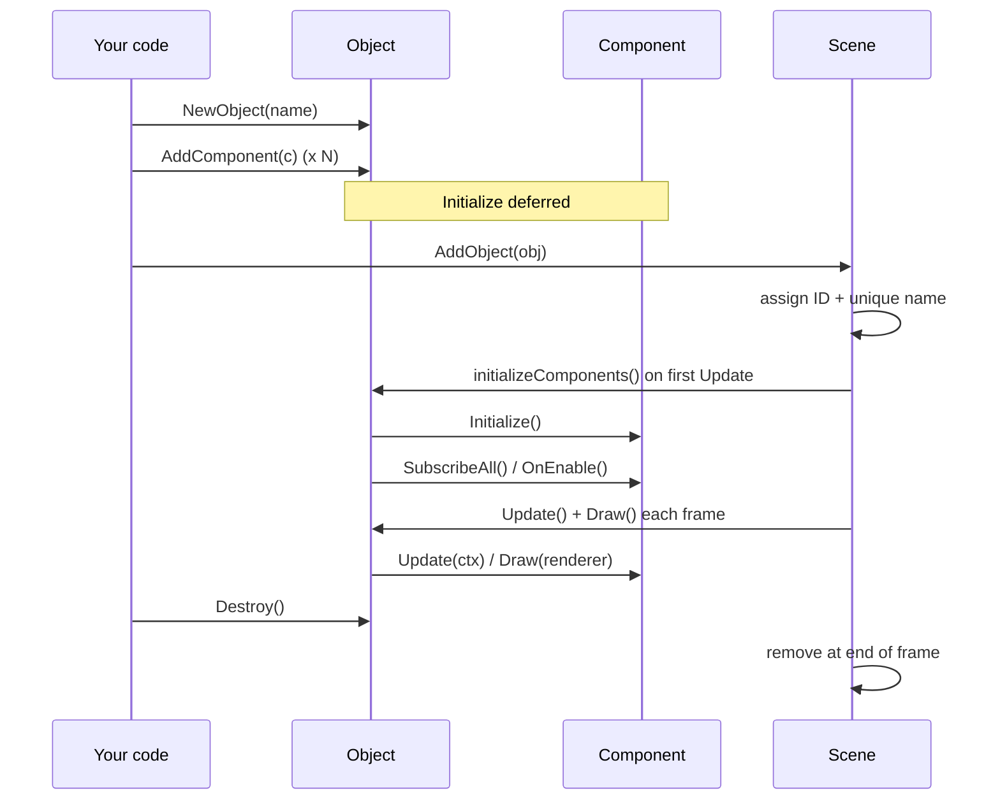

# Objects

An **object** is the fundamental entity in the world. It has a transform, a set of
tags, a depth, and a list of **components** that give it behavior. Objects are the
containers; components are the logic.

## The object fields

| Field | Type | Notes |
|---|---|---|
| `ID` | `uint64` | unique integer, assigned by the scene when added |
| `Name` | string | human-readable, **unique within the scene** |
| `Components` | map | name → component (component names unique within the object) |
| `Tags` | set | free-form labels for filtering (`FindObjectsWithTag`) |
| `Transform` | `math.Transform` | `Position`, `Rotation` (radians), `Scale` |
| `Depth` | float64 | draw order **within a layer** — higher draws on top |
| `Layer` | int | primary draw order — **higher layer draws on top**, compared before `Depth` |
| `UI` | bool | screen-space (ignores camera, drawn after all world objects) |
| `Active` | bool | whether it updates and draws |
| `Scene` | `*Scene` | the scene it belongs to (nil until added) |

## The transform

An object's position, rotation, and scale live in `obj.Transform`:

- `Position` — the object's origin, in world coordinates. This is what components
  read/write, and what the camera follows. Sprite and collider anchors are the
  **top-left** of the object (see `offset` on `@Sprite` / `@Collider` to shift them).
- `Rotation` — radians (0 = facing right, positive = counter-clockwise). `@Spin`
  mutates this. `math.DegreesToRadians` / `math.RadiansToDegrees` convert.
- `Scale` — per-axis scale factors (`{1,1}` = original size).

Set them directly or via helpers: `obj.SetPosition(x, y)`, `obj.SetRotation(r)`,
`obj.SetScale(x, y)`; read via `obj.GetPosition()`, `obj.GetRotation()`,
`obj.GetScale()`.

## Tags

Tags are the primary way to query the world:

- `obj.AddTag(t)`, `obj.RemoveTag(t)`, `obj.HasTag(t)` (O(1)).
- `scene.FindObjectsWithTag(t)` returns all objects with that tag.
- Used pervasively by built-ins: `@Chase`/`@Follow` target a tag, `@Collider`
  filters by `collides_with`, `@Damage` by `target_tags`.

## Layers and draw order

Objects are sorted by **layer first, then depth** — both ascending. A higher
`layer` always draws on top of a lower one, regardless of depth; within a layer,
`depth` orders back-to-front (higher = on top). Within an object, components draw
by their own `draw_layer` (also ascending). The scene re-sorts only when a layer
or depth changes, so changing them mid-frame is cheap.

`obj.SetDepth(d)` and `obj.SetLayer(l)` update the values and mark the scene for
re-sort.

The main use for `layer` is separating fixed chrome from reorderable windows: give
an always-on-top header `layer: 1` and its windows `layer: 0` (the default), and
click-to-front can reorder the windows without ever crossing into the header — no
magic "very high depth" number needed.

## UI objects

An object with `"ui": true` (or `obj.UI = true`) is drawn in **screen space**:

- Its position is in screen **pixels**, not world coordinates.
- It ignores the camera entirely.
- It draws **after every** world object, so it's always on top.

Use it for HUD, menus, and overlays. Example (hearts drawn at screen coords):

```json
{ "name": "hud", "ui": true, "depth": 100, "components": [ { "kind": "GameComponent", "name": "game", "args": {} } ] }
```

## Lifecycle

Objects go through a fixed lifecycle:

1. **Create** — `NewObject(name)` (or loaded from JSON).
2. **Compose** — `AddComponent(component)` for each component. This sets the
   component's owner but **defers** its `Initialize()`.
3. **Add to scene** — `scene.AddObject(obj)` assigns the `ID` (and a unique `Name`
   if the requested one collides — duplicates get a numeric suffix), and registers
   the object in the scene's maps.
4. **Initialize** — on the **first** `Scene.Update` after being added, each
   component's `Initialize()` runs exactly once, its `On()` handlers are subscribed
   to the event manager, and `OnEnable()` fires (if active). This ordering means
   `Initialize()` sees a fully-assembled scene — `c.GetScene()` and sibling lookups
   are valid there.
5. **Update / Draw** — every frame, in component insertion order (update) / draw
   order (draw).
6. **Destroy** — `obj.Destroy()` marks it for destruction (fires `OnDisable` and
   clears its scene ref); the scene removes it at the **end of the frame**.



### Activating / deactivating

`obj.SetActive(false)` pauses the object (no update or draw) and fires
`OnDisable()` on each component; `SetActive(true)` resumes and fires `OnEnable()`.
`obj.Active` is the raw flag.

## The component API on objects

From inside a component, `c.GetOwner()` gives the object; then:

- `core.GetFrom[*T](owner)` — first component of type `T` (insertion order).
- `core.GetAllFrom[*T](owner)` — all of type `T`.
- `core.GetFromNamed[*T](owner, name)` — the component of type `T` with that name
  (O(1)). Use this when several components share a type (e.g. multiple `@Sprite`s).

All return a nil pointer / zero value when nothing matches — always nil-check.

On the object itself: `obj.GetComponent(name)`, `obj.GetComponentByKind(kind)`,
`obj.GetComponentsByKind(kind)`.

## Runtime spawning

Create objects at runtime (e.g. a crate spawning a coin):

- `scene.InstantiateFromTemplate(templatePath, transform)` — loads a `.obj` file and
  adds it (reads from the OS filesystem).
- `scene.InstantiateObject(jsonBytes, transform)` — builds an object from inline JSON.

## Next

- [Scenes & camera](scenes-and-camera.md) — where objects live and how scenes switch.
- [Components](components.md) — what components give objects behavior.
- [Custom components](custom-components.md) — writing your own.
