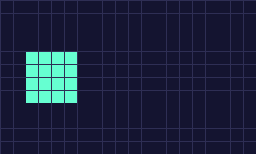
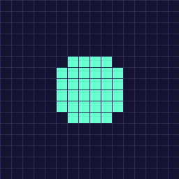
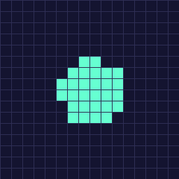
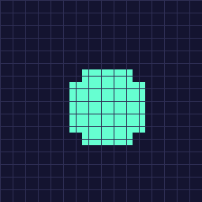
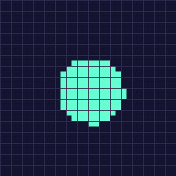
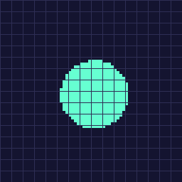
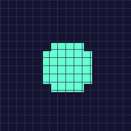
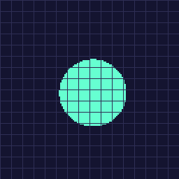
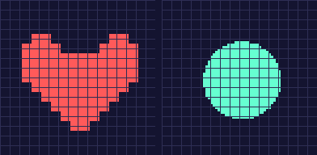

# Rendering: resolution, sub-pixels & smooth shapes

> ← [Documentation index](README.md) · [JSON format](json-format.md)

IMGE is a pixel-art engine, and like all pixel-art engines it has to answer one
question every frame: *where exactly do the pixels go?* Two `game.imge` settings
control the answer:

| Setting | What it controls |
|---|---|
| `window.pixel_per_unit` | how **finely a position can be shown** — the render resolution |
| `window.smooth_shapes` | how **vector shapes are rasterized** — chunky blocks vs fine 1px edges |

They are independent. One decides how smoothly things *move*; the other decides how
*shape edges* look. This page explains both, what "sub-pixel" actually means, and
which combination to pick for which need.

## Logical resolution vs the framebuffer

Your game is written against a **logical resolution** — `window.width × window.height`
game units (e.g. `640 × 360`). All positions, sizes, colliders, and camera math live
in these units and are completely unaffected by rendering settings.

What changes is the **framebuffer** the engine draws into. Each frame is rendered to
a target of `width×pixel_per_unit` by `height×pixel_per_unit` pixels, then that
target is scaled into the window (letterboxed to the aspect ratio; the desktop
window opens at the largest integer scale that fits your monitor, the web build
fills the browser).

```
pixel_per_unit = 1  →  framebuffer is 640×360   (1 pixel per game unit)
pixel_per_unit = 2  →  framebuffer is 1280×720  (2 pixels per game unit)
pixel_per_unit = 4  →  framebuffer is 2560×1440 (4 pixels per game unit)
```

That extra resolution is the entire point of `pixel_per_unit` — it is what lets the
rasterizer show a position that is **between** whole game units.

## `pixel_per_unit` — sub-pixel motion

A position like `x = 54.8` is a `float64`. The engine has to turn it into a whole
number of pixels. With `pixel_per_unit = 1` there is exactly one pixel per game
unit, so the position is rounded to the nearest whole pixel: `54.8` → `55`. The
game *logic* still sees `54.8`, but on screen the object sits at `55`.

The consequence is **snap**: when an object moves by less than one unit per frame,
its on-screen position doesn't change most frames, then jumps a whole pixel at once.
Read as motion, that is the classic pixel-art "jitter". Raising `pixel_per_unit`
shrinks the step — `2` can show half-units (`54.8` → `54.5` or `55.0`), `4` can show
quarter-units (`54.8` → `54.75`), and so on — so the same logical motion glides.

The three loops below are the **same circle moving at the same sub-unit speed**,
rendered at three different `pixel_per_unit` values (all with the default
`smooth_shapes: false`):

| `pixel_per_unit: 1` | `pixel_per_unit: 2` | `pixel_per_unit: 4` | `pixel_per_unit: 8` |
|---|---|---|---|
|  |  |  |  |

At `1` the circle hops one full unit at a time. At `2` it moves in half-units, at
`4` in quarter-units — each step is smaller, so the motion reads as smooth. The
grid lines are one game unit apart; notice the circle only ever rests on grid
boundaries at `1`, but glides across them at `4`.

The trade-off is **memory**, not gameplay: the framebuffer grows with the *square*
of `pixel_per_unit`, so `4` is four times the pixels of `2` and sixteen times `1`.
There is no upper limit, but keep it as small as your smoothness needs — for a
retro game with mostly whole-unit movement, `1` or `2` is plenty; for a game with
fractional velocities and camera smoothing, `4` (or more) removes the jitter.

Nothing else changes: positions, collider sizes, and camera math are all in logical
units, and mouse coordinates are normalized back to logical units for you.

## `smooth_shapes` — chunky vs fine vector shapes

`smooth_shapes` controls how the engine rasterizes **vector shapes** — the five
draw calls `DrawRect`, `DrawRectOutline`, `DrawCircle`, `DrawCircleOutline`, and
`DrawLine`. It does **not** affect sprites or textures (see below).

There are two rasterization models:

- **Chunky** (`smooth_shapes: false`, the default) — the shape is rasterized at
  **logical** resolution with its anchor snapped to whole units, then each logical
  pixel is upscaled into a `pixel_per_unit × pixel_per_unit` block. The block
  pattern is **deterministic** (the same shape + size + color always produces the
  same pixels), and only the block *position* glides at sub-unit precision. This is
  exactly how textures render, so shapes and sprites match.

- **Fine** (`smooth_shapes: true`) — the shape is rasterized directly at **framebuffer**
  resolution at its fractional position. Edges are 1 framebuffer pixel wide, and the
  pixel pattern depends on the exact position.

Here is a filled circle at a fractional position, under every combination. Each cell
shows the same `16×16` logical region scaled to the same display size, so you can
compare the granularity directly:

| `pixel_per_unit` | chunky (`smooth_shapes: false`) | fine (`smooth_shapes: true`) |
|---|---|---|
| `1` |  |  |
| `2` |  |  |
| `4` |  |  |
| `8` |  |  |

Reading the table:

- **Chunky** pixels are always `pixel_per_unit`-sized blocks — the circle looks the
  same whether `pixel_per_unit` is `1`, `2`, `4`, or `8`; only the blocks get larger.
  At `1` chunky and fine happen to be near-identical (one pixel per unit either way).
- **Fine** pixels are always 1 framebuffer pixel, so at `pixel_per_unit: 4` the edge
  is visibly thinner and smoother than the chunky block edge.

### Why chunky is the default, and the wobble it avoids

The chunky model has a property the fine model doesn't: because the anchor is
quantized to whole units, a shape's **pixel pattern never changes as it moves** —
only its position does. A circle gliding across the screen keeps exactly the same
set of filled blocks every frame.

The fine model re-rasterizes at whatever fractional position the shape happens to
be on, so a moving shape's pixels can shift around frame to frame. At
`pixel_per_unit > 1` this is usually invisible (the motion itself is smooth), but
at `pixel_per_unit: 1` a circle's edge can visibly *wobble* as it crosses pixel
boundaries. This is why `smooth_shapes: false` applies at **any** `pixel_per_unit`,
including `1`: it keeps vector shapes pixel-perfect and stable rather than
re-rasterizing at fractional positions.

`smooth_shapes` is **game-wide** — there is no per-shape toggle. If you need both a
chunky look and a fine look in the same game, keep shapes chunky and use a texture
for the fine-grained case (see below).

## Sprites and textures are always chunky

`@Sprite` (and `DrawTexture`) draw images, not vector shapes, and images are **always**
rendered chunky: a texture is nearest-neighbor scaled by `pixel_per_unit`, so its
pixels become `pixel_per_unit`-sized blocks. `smooth_shapes` has no effect on them —
it only concerns the five vector draw calls.



Both panels above are at `pixel_per_unit: 4` — on the left a sprite, on the right a
vector circle rendered with `smooth_shapes: true`. The sprite keeps its blocky
`pixel_per_unit`-sized pixels even though `true` renders the vector shape fine. This
is what keeps your pixel art crisp and aligned to the game grid regardless of the
rendering settings.

## Text is always chunky too

`DrawText` renders a line of text the same way sprites render: the glyphs are
rasterized at the font's **logical** size, then upscaled by `pixel_per_unit ×
camera.zoom` with nearest-neighbor. `smooth_shapes` has no effect on text — a
pixel font drawn at an integer size stays crisp at any `pixel_per_unit`.

### Fonts: the built-in default and your own

`DrawText` takes a *font ID* the same way `DrawTexture` takes a texture ID:

- `""` (or `"imge-font"`) selects the **built-in default font**, a small pixel
  font whose glyphs are 4 units wide × 6 units tall. Call text with no font and
  no size and you get a crisp pixel font.
- Anything else is a **project-root-relative path** to a `.ttf`/`.otf` you dropped
  into your project, resolved through the asset filesystem exactly like a texture:

  ```go
  renderer.DrawText("SCORE 100", "assets/fonts/arcade.ttf", 8, pos, color)
  ```

Fonts load on demand and are cached, so a font file is read once.

### Size and integer scaling

`size` is the font size in **logical units**. For a pixel font it should be the
font's **design size or an integer multiple of it**, so every glyph lands on the
unit grid and the text stays crisp. The built-in font's design size is 6 units
(a 4×6 glyph), so its crisp sizes are 6, 12, 18, … — an 8px font would use 8, 16,
24 instead. At the design size, one font pixel is exactly one game pixel. A
non-integer, off-grid size re-rasterizes the glyphs off-grid and blurs them,
exactly like scaling a sprite by 1.5×. Passing `size <= 0` selects the font's
native (default) size.

### Measuring text

`MeasureText(text, fontID, size)` returns the width and height (in logical units)
of the box `DrawText` places, so you can center or right-align text:

```go
w, h := renderer.MeasureText("Play", "", 0)
renderer.DrawText("Play", "", 0, math.NewVector2(320-w/2, 180-h/2), math.White)
```

Any component can draw text through its `Draw(renderer core.Renderer)` method, the
same way it draws shapes or textures.

### Wrapping text to a width

`DrawTextWrapped` fits text into a maximum width, wrapping or clipping it the way
terminal output, dialogue boxes, and UI paragraphs need:

```go
// Word-wrap: break on spaces, keep whole words together (dialogue / UI).
renderer.DrawTextWrapped("the quick brown fox jumps over", "", 0, 120, core.WrapWord, pos, math.White)

// Hard-wrap: break exactly at the width, splitting words mid-way (terminal / log).
renderer.DrawTextWrapped("error: something went wrong", "", 0, 96, core.WrapChar, pos, math.Red)

// Clip: a single line truncated to the width, nothing wrapped.
renderer.DrawTextWrapped("a very long menu title", "", 0, 80, core.WrapClip, pos, math.White)
```

`position` is the **top-left corner of the whole block**; each line advances by the
font's line height. `maxWidth <= 0` disables width-based breaking (explicit `\n`
still starts a new line). The three `core.WrapMode` values:

- **`WrapWord`** — break on whitespace so whole words stay together. A lone word
  wider than `maxWidth` is still placed on its own line (and overflows).
- **`WrapChar`** — hard-break exactly at `maxWidth`, splitting a word mid-way.
- **`WrapClip`** — don't wrap: truncate to one line that fits `maxWidth`, drop the rest.

`MeasureTextWrapped(text, fontID, size, maxWidth, wrap)` returns the width (the
widest line) and height (line count × line height) of the wrapped block, so you can
center a paragraph the same way `MeasureText` centers a single line.

## Which setting for which need

| You want… | `pixel_per_unit` | `smooth_shapes` |
|---|---|---|
| Maximum retro crispness; movement snaps to whole pixels | `1` | `false` (default) |
| Smooth fractional motion + chunky pixel-art look (the recommended default for a polished game) | `2`–`8` | `false` (default) |
| Thin, fine vector edges — hairline HUD bars, thin outlines, smooth curves | any (often `1`) | `true` |
| Chunky shapes in one place and fine shapes in another | any | `false` + use a texture for the fine part |

A few practical notes to keep in mind:

- **`pixel_per_unit` is about motion, `smooth_shapes` is about edge style.** Raising
  `pixel_per_unit` makes *everything* move smoother (sprites and shapes alike);
  flipping `smooth_shapes` only changes how vector *edges* are rasterized.
- **Both apply game-wide.** You can't make one object move smoother or one shape
  render finer than another — the whole game shares these settings.
- **Camera zoom multiplies in.** The final on-screen scale is `camera.zoom ×
  pixel_per_unit`, so a zoomed-in camera also magnifies the block size (and, on the
  fine path, the edge thickness).
- **At `pixel_per_unit: 1`, the two `smooth_shapes` values look almost identical** —
  the difference only matters as a shape *moves* (chunky stays stable, fine can
  wobble). For still art the distinction is negligible at `1`.

## At a glance

| Draw call | Affected by `smooth_shapes` | Rendered model |
|---|---|---|
| `DrawRect` / `DrawRectOutline` | yes | chunky (default) or fine |
| `DrawCircle` / `DrawCircleOutline` | yes | chunky (default) or fine |
| `DrawLine` | yes | chunky (default) or fine |
| `@Sprite` / `DrawTexture` | no | always chunky |
| `DrawText` / `DrawTextWrapped` | no | always chunky |

> The images on this page are produced by a small software rasterizer that
> reproduces the engine's two models (`go run ./cmd/renderdemo`). They are
> illustrative diagrams of the geometry, not pixel-exact engine dumps.
